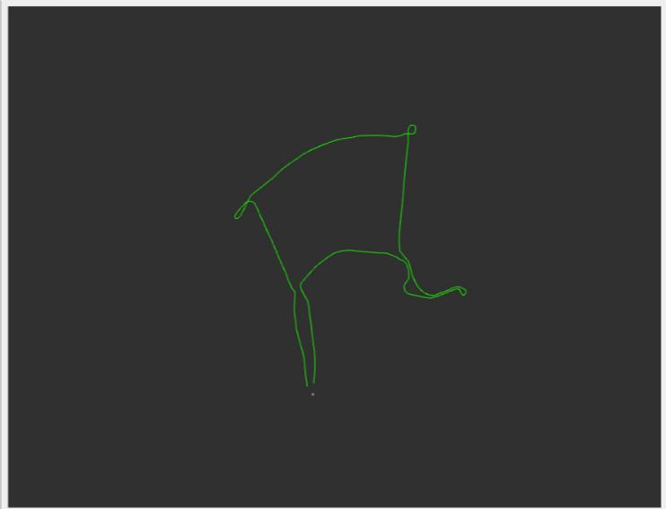

# kml_parser
A ROS 2 package for parsing .kml files and convert it to the local cartesian coordinates.

## Requirements
- [ROS2 Humble](https://docs.ros.org/en/humble/Installation/Ubuntu-Install-Debians.html)
- [libkml](https://github.com/google/libkml)
- [GeographicLib](https://geographiclib.sourceforge.io/C++/doc/install.html)

## Firstly create workspace:
```
mkdir -p ~/ros2_ws/src
cd ~/ros2_ws/src

```
## Clone this repository into the workspace
```
git clone https://github.com/hakanaktass/kml_parser.git
```
## Source and Build Workspace

```
source /opt/ros/humble/setup.bash
colcon build --symlink-install --cmake-args -DCMAKE_BUILD_TYPE=Release

```

## Parameters

Please update necessary paths on kml_parser.param.yaml.

| Parameter Name                 | Description                                                     | value                                             |
| ------------------------------ | --------------------------------------------------------------- | ------------------------------------------------- |
| kml_file_path                  | KML File path                                                   | absolute path of kml file (string)                |

## Launch 

```
source install/setup.bash
ros2 launch kml_parser kml_parser.launch.xml

```


## Results


